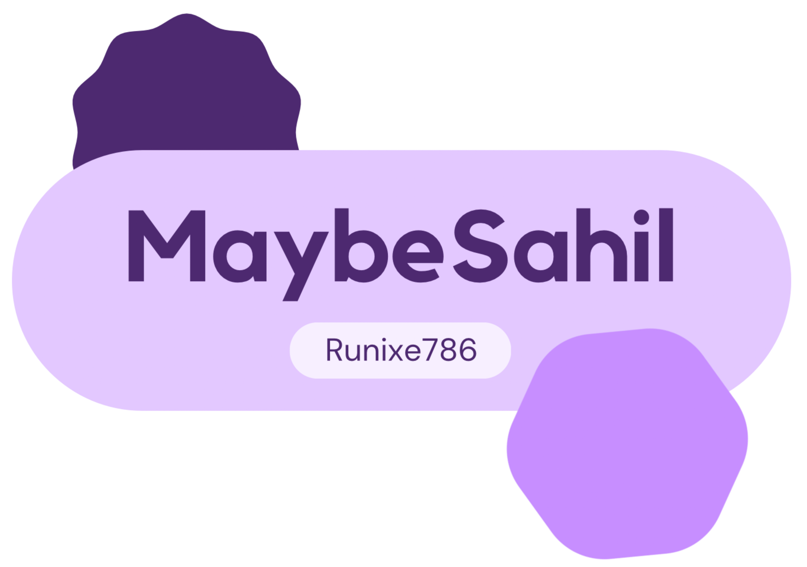

  

  
  
  

  
  
  
  
  
  
  
  
  
  
  
  
  
  
  
  
  
  
  
  
  
  
  
  

 

  
  <h1>Macified Windows</h1>
  💳 Now achieve MacOS look on your windows desktop using my guides.
    
  

    
    
    
  

 

  
  <h1>Tunify</h1>
  🏅 Script to auto update your spotify status of what you are currently listening on telegram.
    
  

    
    
    
    
    
    
  

 
 
 

  
  <picture>
    <source media="(prefers-color-scheme: dark)" srcset="https://i.postimg.cc/KzPKjBNn/footer-Dark.png">
    <source media="(prefers-color-scheme: light)" srcset="https://i.postimg.cc/C5wRq5P9/footer-Light.png">
    
  </picture>

